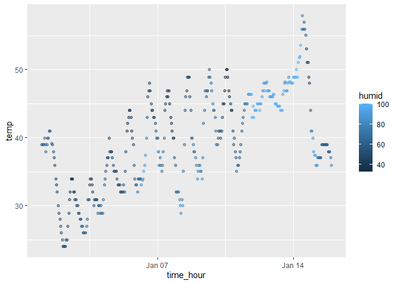

hw1
================
Rene Chi
2025-09-13

## Problem 1

Loading needed packages

``` r
library(moderndive)
library(ggplot2)
library(tidyverse)
```

Importing data while inspecting it

``` r
data("early_january_weather")
summary(early_january_weather)
```

The `early_january_weather` dataset contains variables include `year`,
`month`, `day`, `hour`, `origin` (Newark airport), `temp` (temperature
in Fahrenheit), `dewp` (dew point), `humid` (relative humidity),
`wind_dir` (wind direction), `wind_speed`, `wind_gust`, `precip`
(precipitation in inches), `pressure` (sea level pressure in millibars),
`visib` (visibility in miles), and `time_hour`
(yyyy/mm/dd/hr/min/second).

This dataset has 358 rows and 15 columns. The mean temperature during
this period is 39.5821229 degrees Fahrenheit.

Plotting a scatterplot between temp(y) and time_hour(x)

``` r
#plotting scatter plot 
Sys.setlocale("LC_TIME", "C") # transfer date from mandarin to english
ggplot(early_january_weather, 
       aes(x = time_hour, 
           y = temp, 
           color = humid)) +
       geom_point(alpha = 0.5) 
```

<!-- -->

``` r
# Save plot
ggsave("early_january_weather.png", width = 8, height = 5, dpi = 300)
```

In the scatterplot, it is apparent that before January 11st, in most
days the relative humidity were below 60. Roughly between January 11st
and 15th, both relative humidity and temperature were steadily rising,
while temperature plunged after Jan 15th.

## Problem 2

``` r
set.seed(123)  # reproducibility

# build tibble
tb <- tibble(
  sample = rnorm(10),
  positive = sample > 0,
  chr_10 = c("This","class","is","important",
            "for","my","future","studying","in","biostatistics"),
  factor_level = factor(rep(c("A", "B", "C"), length.out = 10))
)

# attempting to calculate average
tb %>% pull(sample) %>% mean()
```

    ## [1] 0.07462564

``` r
tb %>% pull(positive) %>% mean()
```

    ## [1] 0.5

``` r
tb %>% pull(chr_10) %>% mean()
```

    ## Warning in mean.default(.): argument is not numeric or logical: returning NA

    ## [1] NA

``` r
tb %>% pull(factor_level) %>% mean()
```

    ## Warning in mean.default(.): argument is not numeric or logical: returning NA

    ## [1] NA

Only the first two variables ‘sample’ and ‘positive’ works, the latter
two variables returned NA value.

``` r
# apply as.numeric() to logical, character, and factor variables
as.numeric(tb$sample)
as.numeric(tb$positive)
as.numeric(tb$chr_10)
as.numeric(tb$factor_level)
```

When as.numeric() is applied, logical values are converted to 1 and 0,
so taking the mean works and gives the proportion of TRUE values, this
can also be applied when using mean(). Character vectors cannot be
converted to numbers, so as.numeric() returns NA and produces a warning,
which is why mean() fails.  
Factor vectors are converted to their internal integer when using
as.numeric(), allowing R to calculate its mean (although it is
meaningless). However, when computing directly with mean(), it will
return as NA since mean() will not convert the factor vectors.
